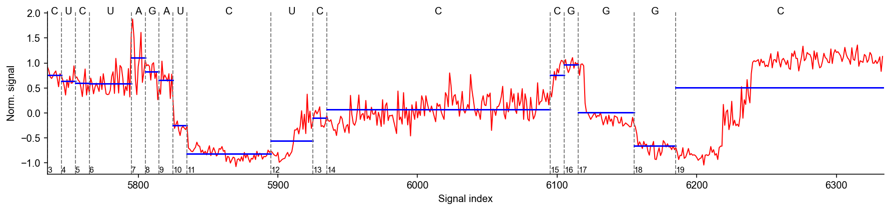

# Nanopore Squiggle

Jupyter Notebooks ([raw_signal_visual.ipynb](notebooks/raw_signal_visual.ipynb)) to visualise nanopore raw signal.

## Roadmap

- [] [SLOW5 format](https://github.com/hasindu2008/slow5tools) support.
- [] Visualise [f5c](https://github.com/hasindu2008/f5c) resquiggle.

## LICENSE

[Anti 996 License](https://github.com/kattgu7/Anti-996-License/blob/master/LICENSE_CN_EN)